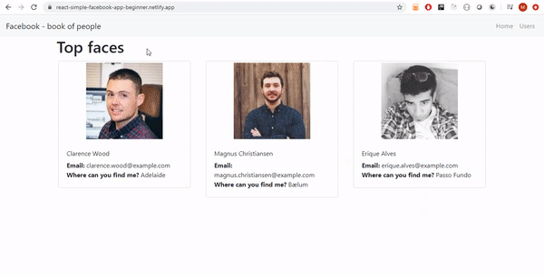

# Reactjs - a simple Facebook app for beginners

 
Live demo: https://react-simple-facebook-app-beginner.netlify.app/

A simple project based on React. 

- ReactJS tutorial - How to create first app? Building a facebook app. Course for beginners. [ENG]
    - https://www.youtube.com/watch?v=k5uVrwpW1tA&list=PLRkaFIl3mgdXYPTZ2nUiJKNY30wV7ZxZn&ab_channel=ShowMeYourCode%21
- How to add Typescript to existing ReactJS project? Step by step tutorial [ENG]
    - https://www.youtube.com/watch?v=A_rrMXLwyqI
- Generate React component using CLI [ENG]
    - https://youtu.be/aCoHxxrbVIY
  
***BE AWARE!***   
**The project uses React 16.7. A version 16.8 introduced a new hook ``useEffect`` which replaces old hooks: ``componentDidMount``, ``componentDidUpdate`` and ``componentWillUnmount``. More info here: https://reactjs.org/docs/hooks-effect.html**  

## Technology stack
- React 16.7
- Typescript (initially a project was bootstraped without Typescript, then it was migrated)
- Reactstrap
- Axios (http library)

## Local development
### Project setup
1. Go to the root directory
2. Install dependencies using a command ``npm install``
3. Start the application using a command ``npm run start``

### Generating components
https://www.npmjs.com/package/generate-react-cli  
- Generate component
    - ``npx generate-react-cli component Box``
